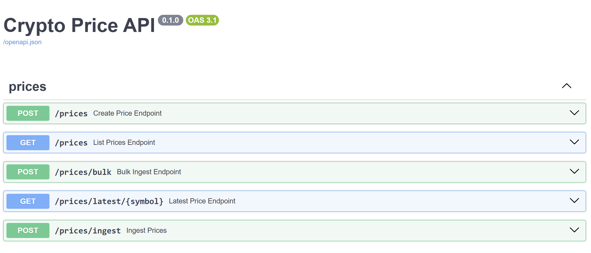

# Crypto Price Tracker

## Table of Content
- [ Brief Summary](#brief-summary)
- [ Tech Stack](#tech-stack)
- [ Features](#features)
- [ Setup](#setup)
- [ What I Learned](#what-i-learned)
- [ Further Improvements](#further-improvements)

## Brief summary

A compact end to end crypto price tracker built for learning. The project fetches live cryptocurrency prices from the CoinGecko API, stores them in PostgreSQL, exposes a typed REST API with FastAPI, and supports scheduled ingestion. A Power BI report visualises the stored data. This repository is designed to be easy to run locally and clear to read for reviewers. 

## Tech Stack
- **Language:** Python 3.11+  
- **API:** FastAPI, Pydantic  
- **ORM / Migrations:** SQLAlchemy 2.x, Alembic  
- **Database:** PostgreSQL (SQLite used for tests)  
- **Ingestion:** CoinGecko API (pycoingecko)  
- **Scheduling:** OS scheduler (Windows Task Scheduler).
- **Visualisation:** Power BI Desktop  
- **Testing and quality:** pytest 
- **Dev tooling:** Docker

## Features
- Typed REST API
  - `POST /prices` create a single price record
  - `POST /prices/bulk` idempotent bulk upsert
  - `POST /prices/ingest` trigger ingestion for a list of symbols
  - `GET /prices` list prices with filters
  - `GET /prices/latest/{symbol}` latest price for a symbol
- Reliable storage
  - PostgreSQL schema with unique constraint to avoid duplicates
  - Server-side default for timestamping
- Ingestion pipeline
  - Fetches live prices from CoinGecko and writes to the database
  - Designed to be run as a scheduled script or via the ingestion endpoint
- Visualisation
  - Power BI report with KPI cards, line charts and symbol slicer
  - Average daily price aggregation for trend analysis

 **Images**  

---

## Setup

Clone the repo, create .env from the template and then:

`git clone <repo-url>`
`cd crypto-tracker`
`chmod +x ./deploy.sh`
`./deploy.sh`

deploy.sh will:

- create a virtual environment,

- install dependencies from requirements.txt,

- create .env from .env.example if it does not exist,

- run database migrations (if Alembic is configured),

- start the app with Uvicorn.

### Useful commands

#### Start server:
`uvicorn app.main:app --reload`

#### Run ingestion manually:
`python -m app.ingestion.fetch`

#### Call ingestion via API:
`curl -X POST "http://localhost:8000/prices/ingest" -H "Content-Type: application/json" -d '["bitcoin","ethereum"]'`

### Testing
Run the test suite locally:

`python -m pytest -q`

#### Notes:

- Tests use an isolated SQLite database for speed.

- If you see Decimal serialization errors in API tests, ensure Pydantic encoding is configured for Decimal or use jsonable_encoder in endpoints.

- If tests fail because of database file locks on Windows, run the tests again after closing any DB browser and ensure the test DB is a temporary file per session.

### Scheduling ingestion

Two recommended approaches:

Run the ingestion module directly from a scheduler:

`python -m app.ingestion.fetch` in **ingest.bat** for Windows Task Scheduler or a cron job on Unix.

Trigger the /prices/ingest endpoint with curl or PowerShell from the scheduler.

Direct script invocation is simpler and more reliable for a small personal project.

---

## What I Learned
A concise list of the most important skills gained while building this project:

- Designing typed REST APIs with FastAPI and Pydantic for validation and auto documentation.

- Practical SQLAlchemy 2.x usage and Alembic migrations, including server defaults and unique constraints.

- Building an idempotent ingestion pipeline with bulk upsert semantics for reliability.

- Handling differences between SQLite and PostgreSQL in tests and migrations.

- Scheduling and small operational tooling: writing a scheduler-friendly ingestion module, running it with Task Scheduler.

- Creating interactive business analytics in Power BI and connecting it to a local Postgres database.

## Further Improvements
Ideas to make the project production ready or more feature rich:

- Replace FastAPI background tasks with a task queue such as Celery or RQ for retries, monitoring and persistence.

- Adopt Airflow or Prefect for orchestrating more complex pipelines and dependencies.

- Add API authentication, rate limiting and secrets management.

- Add CI/CD to run migrations and tests automatically.

- Add more analytics endpoints, for example OHLC and volatility, and precompute aggregates for visualisation.

- Store KPI targets in the database and use them in Power BI so targets update without manual dashboard edits.
